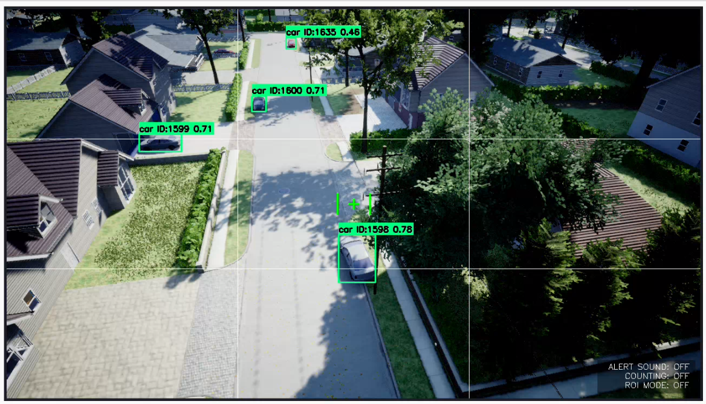
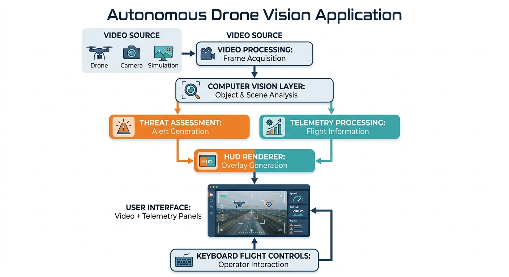

# Autonomous Drone Vision Application

A modular real-time aerial perception and control interface for drone systems, combining computer vision, operator interaction, telemetry visualization, and safety-aware scene monitoring.

---

## Abstract

This project explores the design and implementation of a modular architecture for real-time drone perception and operator interaction. The system separates control, perception, visualization, and user interface components to improve maintainability, scalability, and real-time performance.

The project is intended as a research-oriented implementation for experimentation in:

- Real-time Computer Vision
- Human–Machine Interaction
- Aerial Telemetry Visualization
- Operator Decision Support
- Autonomous System Interface Design

---

## Public Repository Notice

This repository represents the public-facing portion of a larger research and development project.

It includes selected interface, visualization, and perception components that demonstrate the overall software architecture and engineering approach.

Core research modules—including autonomous decision-making, navigation, hardware communication, sensor integration, and other proprietary implementations—are intentionally excluded from this repository due to ongoing development and research considerations.

The objective of this repository is to present the project's software engineering practices, modular architecture, and real-time computer vision capabilities while preserving the integrity of the complete research system.


---

## Project Status

Active research and development project.

Current capabilities:
- Real-time aerial object perception
- Vision-based monitoring interface
- Telemetry visualization
- Modular AI perception pipeline

Under development:
- Advanced autonomous control
- Sensor fusion
- Hardware integration
- Extended simulation scenarios

---


# Demo

## System Demonstration

A short demonstration of the autonomous drone vision application showing real-time perception, interface visualization, telemetry monitoring, and system interaction.



▶️ Full demonstration video: [View Demo](assets/airsim.mp4)

## Main Interface


---

## HUD Overlay


---

## Telemetry Display


---

## Features

- Real-time video visualization
- Modular user interface
- Telemetry visualization
- Horizon indicator
- Keyboard flight controls
- HUD overlay rendering
- Scene monitoring
- Threat level visualization
- Real-time operator feedback
- Modular software architecture

---

## Public Modules

### Control Layer

- Keyboard flight controller

### Perception Layer

- Scene monitoring
- Threat level estimation
- Operator alert generation

### Visualization Layer

- HUD overlay renderer
- Video streaming interface
- Telemetry visualization panel

---

## System Architecture



---

## Technology Stack

- Python
- OpenCV
- NumPy
- PyQt5
- Real-time Video Processing

---

## Repository Structure

```
autonomous-drone-vision-application
│
├── app.py
├── requirements.txt
├── README.md
│
├── controls/
├── perception/
├── overlays/
├── ui/
│
├── architecture/
├── docs/
├── examples/
├── screenshots/
└── assets/
```

---

## Research Applications

This project demonstrates concepts applicable to:

- Computer Vision
- Autonomous Systems
- Human–Machine Interaction
- Robotics Software Engineering
- Real-Time Perception Systems
- Drone Interface Development

---

## Future Work

- Multi-object tracking
- Sensor fusion
- Autonomous navigation
- AI-assisted target prioritization
- Edge AI deployment
- Performance optimization
- Cross-platform deployment

---

## License

This repository is released for educational and research purposes.
